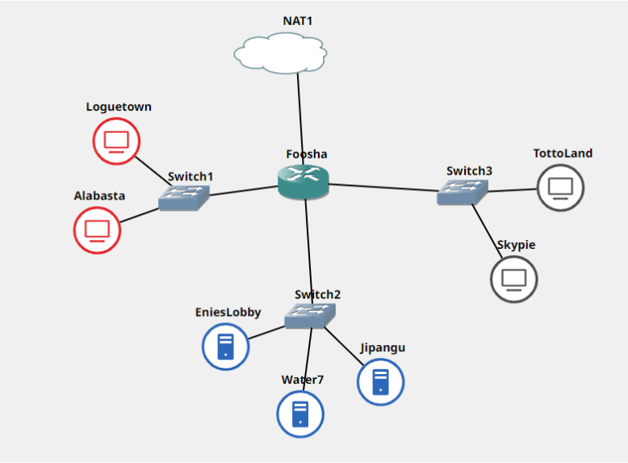

# Jarkom-Modul-3-B10-2021

## Anggota B10
Nama | NRP | Pembagian
------------ | ------------- | -------------
Pramudya Tiandana Wisnu Gautama | 05111940000018 | x - x
Jason Andrew Gunawan | 05111940000085 | x - x
Frans Wijaya | 05111940000098 | x - x

### Keterangan:
- yyy adalah nama kelompok Anda
- Untuk nomor 9, harus htpasswd yang melakukan enkripsi
- Bisa melakukan wget [GitHub](https://raw.githubusercontent.com/FeinardSlim/Praktikum-Modul-2-Jarkom/main/super.franky.zip) untuk mendapatkan file untuk super.franky.yyy.com

## Soal
Luffy yang sudah menjadi Raja Bajak Laut ingin mengembangkan daerah kekuasaannya dengan membuat peta seperti berikut:

## Soal 1
Luffy bersama Zoro berencana membuat peta tersebut dengan kriteria **EniesLobby** sebagai DNS Server, **Jipangu** sebagai DHCP Server, **Water7** sebagai Proxy Server (1),
### Solusi 1

## Soal 2
dan **Foosha** sebagai DHCP Relay (2). Luffy dan Zoro **menyusun peta tersebut dengan hati-hati dan teliti**.
### Solusi 2

## Soal 3
Semua client yang ada **HARUS** menggunakan konfigurasi IP dari DHCP Server.

Client yang melalui Switch1 mendapatkan range IP dari [prefix IP].1.20 - [prefix IP].1.99 dan [prefix IP].1.150 - [prefix IP].1.169 (3)
### Solusi 3

## Soal 4
Client yang melalui Switch3 mendapatkan range IP dari [prefix IP].3.30 - [prefix IP].3.50 (4) 
### Solusi 4

## Soal 5
Client mendapatkan DNS dari EniesLobby dan client dapat terhubung dengan internet melalui DNS tersebut. (5)
### Solusi 5

## Soal 6
Lama waktu DHCP server meminjamkan alamat IP kepada Client yang melalui Switch1 selama 6 menit sedangkan pada client yang melalui Switch3 selama 12 menit. Dengan waktu maksimal yang dialokasikan untuk peminjaman alamat IP selama 120 menit. (6)
### Solusi 6

## Soal 7
Luffy dan Zoro berencana menjadikan **Skypie** sebagai server untuk jual beli kapal yang dimilikinya dengan **alamat IP yang tetap** dengan IP [prefix IP].3.69 (7). **Loguetown** digunakan sebagai client **Proxy** agar transaksi jual beli dapat terjamin keamanannya, juga untuk mencegah kebocoran data transaksi.
### Solusi 7

## Soal 8
Pada Loguetown, proxy **harus bisa diakses** dengan nama **jualbelikapal.yyy.com** dengan **port** yang digunakan adalah **5000** (8).
### Solusi 8

## Soal 9
Agar transaksi jual beli lebih aman dan pengguna website ada dua orang, proxy dipasang **autentikasi user proxy dengan enkripsi bcrypt** dengan **dua username**, yaitu luffybelikapalyyy dengan password luffy_yyy **dan** zorobelikapalyyy dengan password zoro_yyy (9).
### Solusi 9

## Soal 10
Transaksi jual beli tidak dilakukan setiap hari, oleh karena itu akses internet dibatasi hanya dapat diakses setiap hari **Senin-Kamis pukul 07.00-11.00** dan setiap hari **Selasa-Jum’at pukul 17.00-03.00** keesokan harinya **(sampai Sabtu pukul 03.00)** (10).
### Solusi 10

## Soal 11
Agar transaksi bisa lebih fokus berjalan, maka dilakukan redirect website agar mudah mengingat website transaksi jual beli kapal. Setiap **mengakses google.com, akan diredirect menuju super.franky.yyy.com** dengan website yang sama pada soal shift modul 2. Web server super.franky.yyy.com berada pada node **Skypie** (11).
### Solusi 11

## Soal 12
Saatnya berlayar! Luffy dan Zoro akhirnya memutuskan untuk berlayar untuk **mencari harta karun di super.franky.yyy.com**. Tugas pencarian dibagi menjadi dua misi, Luffy bertugas untuk mendapatkan gambar (.png, .jpg), sedangkan Zoro mencari sisanya. Karena Luffy orangnya sangat teliti untuk mencari harta karun, ketika ia berhasil mendapatkan gambar, ia mendapatkan gambar dan melihatnya dengan kecepatan **10 kbps** (12).
### Solusi 12

## Soal 13
Sedangkan, Zoro yang sangat bersemangat untuk mencari harta karun, sehingga kecepatan kapal Zoro tidak dibatasi ketika sudah mendapatkan harta yang diinginkannya (13).
### Solusi 13

## Kendala
- kosong