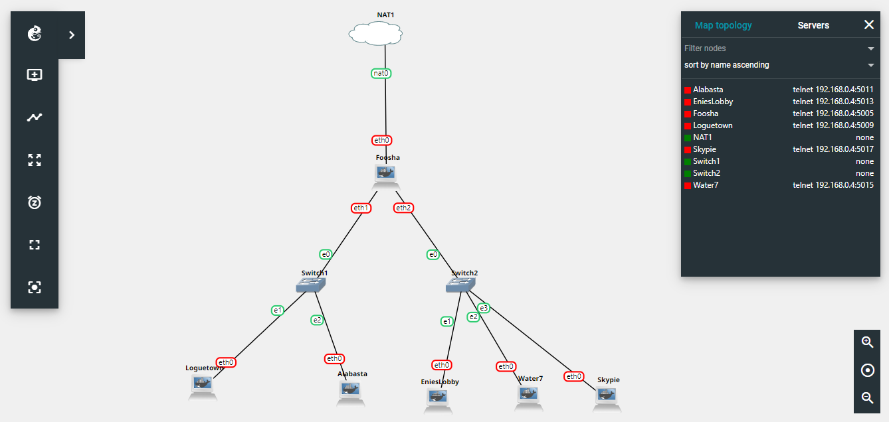
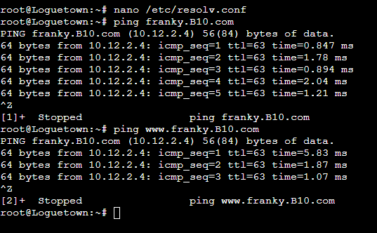
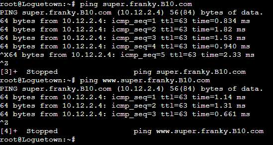
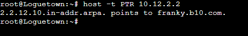
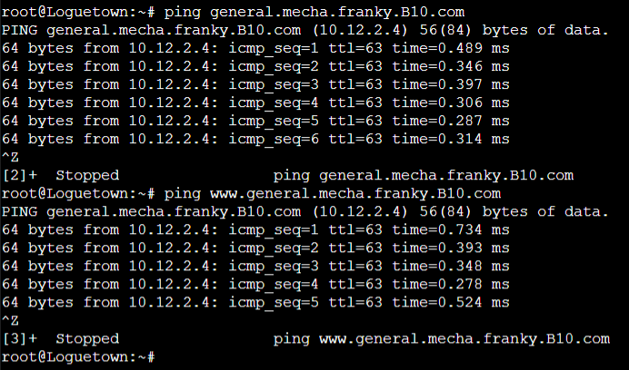

# Jarkom-Modul-2-B10-2021

## Anggota B10
Nama | NRP | Pembagian
------------ | ------------- | -------------
Pramudya Tiandana Wisnu Gautama | 05111940000018 | 1 - 5
Jason Andrew Gunawan | 05111940000085 | 12-17
Frans Wijaya | 05111940000098 | 6 - 11

### ps:
- yyy pada url adalah kode kelompok anda
- File Requirement [Github](https://github.com/FeinardSlim/Praktikum-Modul-2-Jarkom)

## Soal 1
Luffy adalah seorang yang akan jadi Raja Bajak Laut. Demi membuat Luffy menjadi Raja Bajak Laut, Nami ingin membuat sebuah peta, bantu Nami untuk membuat peta berikut:

EniesLobby akan dijadikan sebagai DNS Master, Water7 akan dijadikan DNS Slave, dan Skypie akan digunakan sebagai Web Server. Terdapat 2 Client yaitu Loguetown, dan Alabasta. Semua node terhubung pada router Foosha, sehingga dapat mengakses internet (1).
### Solusi 1
Untuk soal 1, kami buat topologi yang sesuai dengan permintaan soal. Untuk konfigurasi siapa yang menjadi client, DNS Master, dan sebagainya, dikonfigurasi sepanjang soal-soal selanjutnya.

### Foosha (Router)
```
auto eth0
iface eth0 inet dhcp

auto eth1
iface eth1 inet static
	address 10.12.1.1
	netmask 255.255.255.0

auto eth2
iface eth2 inet static
	address 10.12.2.1
	netmask 255.255.255.0
```
### EnniesLobby (DNS Master)
```
auto eth0
iface eth0 inet static
	address 10.12.2.2
	netmask 255.255.255.0
	gateway 10.12.2.1
```
### Water 7 (DNS Slave)
```
auto eth0
iface eth0 inet static
	address 10.12.2.3
	netmask 255.255.255.0
	gateway 10.12.2.1
```
### Skypie (Web Server)
```
auto eth0
iface eth0 inet static
	address 10.12.2.4
	netmask 255.255.255.0
	gateway 10.12.2.1
```
### Loguetown (Client)
```
auto eth0
iface eth0 inet static
	address 10.12.1.2
	netmask 255.255.255.0
	gateway 10.12.1.1
```
### Alabasta (Client)
```
auto eth0
iface eth0 inet static
	address 10.12.1.3
	netmask 255.255.255.0
	gateway 10.12.1.1
```

## Soal 2
Luffy ingin menghubungi Franky yang berada di EniesLobby dengan denden mushi. Kalian diminta Luffy untuk membuat website utama dengan mengakses **franky.yyy.com** dengan alias **www.franky.yyy.com** pada folder kaizoku (2).
### Solusi 2
Untuk menyelesaikan permintaan soal 2, dilakukan langkah-langkah berikut:
- Install bind9 ```apt-get install bind9```
- Edit konfigurasi ```nano /etc/bind/named.local.conf``` dengan menambahkan potongan kode berikut ini:
```
zone "franky.B10.com" {
        type master;
        file "/etc/bind/kaizoku/franky.B10.com";
};
```
- Buat folder kaizoku ```mkdir /etc/bind/kaizoku```
- Mengganti konfigurasi untuk franky.B10.com ```nano /etc/bind/kaizoku/franky.B10.com```
```
;
; BIND data file for local loopback interface
;
$TTL    604800
@       IN      SOA     franky.B10.com. root.franky.B10.com. (
                              2021102601                ; Serial
                         604800         ; Refresh
                          86400         ; Retry
                        2419200         ; Expire
                         604800 )       ; Negative Cache TTL
;
@       IN      NS      franky.B10.com.
@       IN      A       10.12.2.2
www     IN      CNAME   franky.B10.com.
```
- ```www     IN      CNAME   franky.B10.com.``` Di sini berfungsi untuk membuat alias dari franky.B10.com
- Menambahkan nameserver pada Loguetown dan Alabasta ```nano /etc/resolv.conf```
```
nameserver 10.12.2.2
```
- Testing dilakukan dengan cara ping franky.B10.com dan www.franky.B10.com 
```
ping franky.B10.com
ping www.franky.B10.com
```



## Soal 3
Setelah itu buat subdomain **super.franky.yyy.com** dengan alias **www.super.franky.yyy.com** yang diatur DNS nya di EniesLobby dan mengarah ke Skypie(3).
### Solusi 3
- Mengedit konfigurasi DNS EniesLobby ```nano /etc/bind/kaizoku/franky.B10.com```
- Menambahkan konfigurasi untuk menyediakan subdomain super franky yang mengarah ke skypie (10.12.2.4)
```
super   IN      A       10.12.2.4
www.super       IN      CNAME   super.franky.B10.com.
```
- File franky.B10.com menjadi:
```
;
; BIND data file for local loopback interface
;
$TTL    604800
@       IN      SOA     franky.B10.com. root.franky.B10.com. (
                              2021102601                ; Serial
                         604800         ; Refresh
                          86400         ; Retry
                        2419200         ; Expire
                         604800 )       ; Negative Cache TTL
;
@       IN      NS      franky.B10.com.
@       IN      A       10.12.2.2
www     IN      CNAME   franky.B10.com.
super   IN      A       10.12.2.4
www.super       IN      CNAME   super.franky.B10.com.
```
- Testing dengan melakukan ping ke super.franky.B10.com

## Soal 4
Buat juga reverse domain untuk domain utama (4). 
### Solusi 4
Langkah-langkah yang dilakukan:
- Menambahkan konfigurasi pada named.conf.local ```nano /etc/bind/named.conf.local```
```
zone "2.12.10.in-addr.arpa" {
    type master;
    file "/etc/bind/kaizoku/2.12.10.in-addr.arpa";
};
```
- Membuat file konfigurasi DNS 2.12.10.in-addr.arpa ```nano /etc/bind/kaizoku/franky.B10.com```
```
;
; BIND data file for local loopback interface
;
$TTL    604800
@       IN      SOA     franky.B10.com. root.franky.B10.com. (
                              2021102601                ; Serial
                         604800         ; Refresh
                          86400         ; Retry
                        2419200         ; Expire
                         604800 )       ; Negative Cache TTL
;
2.12.10.in-addr.arpa.   IN      NS      franky.B10.com.
2       IN      PTR     franky.B10.com.
@       IN      AAAA    ::1
```
- Untuk testingnya, dilakukan pada Loguetown

## Soal 5
Supaya tetap bisa menghubungi Franky jika server EniesLobby rusak, maka buat Water7 sebagai DNS Slave untuk domain utama (5).
### Solusi 5
Langkah-langkah untuk menyelesaikan soal 5:
- Mengganti konfigurasi local pada EniesLobbby 
```
zone "franky.B10.com" {
      type master;
      notify yes;
      also-notify { 10.12.2.3; };
      allow-transfer { 10.12.2.3; };
      file "/etc/bind/kaizoku/franky.B10.com";
};
```
- Menyiapkan konfigurasi DNS pada Water7
```
zone "franky.B10.com" {
    type slave;
    masters { 10.12.2.2; };
    file "/var/etc/bind/franky.B10.com";
};
```
## Soal 6
Setelah itu terdapat subdomain **mecha.franky.yyy.com** dengan alias **www.mecha.franky.yyy.com** yang didelegasikan dari EniesLobby ke Water7 dengan IP menuju ke Skypie dalam folder sunnygo(6).
### Solusi 6
- Mengganti konfigurasi dns pada EnieLobby. Pada bagian ini, ditambahkan baris ns1 dan mecha untuk mendelegasikan subdomain.
```

;
; BIND data file for local loopback interface
;
$TTL    604800
@       IN      SOA     franky.B10.com. root.franky.B10.com. (
                              2021102601                ; Serial
                         604800         ; Refresh
                          86400         ; Retry
                        2419200         ; Expire
                         604800 )       ; Negative Cache TTL
;
@       IN      NS      franky.B10.com.
@       IN      A       10.12.2.4
www     IN      CNAME   franky.B10.com.
super   IN      A       10.12.2.4
www.super       IN      CNAME   super.franky.B10.com.
ns1     IN      A       10.12.2.3
mecha   IN      NS      ns1
@       IN      AAAA    ::1
```
- Pada Water7, dibuat folder sunnygo terlebih dahulu ```mkdir /etc/bind/sunnygo```
- Pada Water7, dibuat file mecha.franky.B10.com ```nano /etc/bind/sunnygo/mecha.franky.B10.com``. Berikut konfigurasinya
```
  GNU nano 2.5.3    File: /etc/bind/sunnygo/mecha.franky.B10.com                

;
; BIND data file for local loopback interface
;
$TTL    604800
@       IN      SOA     mecha.franky.B10.com. root.mecha.franky.B10.com. (
                              2021102601                ; Serial
                         604800         ; Refresh
                          86400         ; Retry
                        2419200         ; Expire
                         604800 )       ; Negative Cache TTL
;
@       IN      NS      mecha.franky.B10.com.
@       IN      A       10.12.2.4
www     IN      CNAME   mecha.franky.B10.com.
general IN      A       10.12.2.4
www.general     IN      CNAME   general.mecha.franky.B10.com.
```

## Soal 7
Untuk memperlancar komunikasi Luffy dan rekannya, dibuatkan subdomain melalui Water7 dengan nama **general.mecha.franky.yyy.com** dengan alias **www.general.mecha.franky.yyy.com** yang mengarah ke Skypie(7).
### Solusi 7
- Mengedit konfigurasi DNS Water7 ```nano /etc/bind/sunnygo/mecha.franky.B10.com```
- Menambahkan konfigurasi untuk menyediakan subdomain general mecha franky yang mengarah ke skypie (10.12.2.4)
```
general IN      A       10.12.2.4
www.general     IN      CNAME   general.mecha.franky.B10.com.
```
- File mecha.franky.B10.com menjadi:
```
;
; BIND data file for local loopback interface
;
$TTL    604800
@       IN      SOA     mecha.franky.B10.com. root.mecha.franky.B10.com. (
                              2021102601                ; Serial
                         604800         ; Refresh
                          86400         ; Retry
                        2419200         ; Expire
                         604800 )       ; Negative Cache TTL
;
@       IN      NS      mecha.franky.B10.com.
@       IN      A       10.12.2.4
www     IN      CNAME   mecha.franky.B10.com.
general IN      A       10.12.2.4
www.general     IN      CNAME   general.mecha.franky.B10.com.
```
- Testing dengan melakukan ping ke super.franky.B10.com

## Soal 8
(8) Setelah melakukan konfigurasi server, maka dilakukan konfigurasi Webserver. Pertama dengan webserver **www.franky.yyy.com**. Pertama, luffy membutuhkan webserver dengan DocumentRoot pada /var/www/franky.yyy.com.
### Solusi 8
**Skypie**
- Install beberapa aplikasi yang diperlukan
```
apt-get update
apt-get install apache2 -y
apt-get install php -y
apt-get install libapache2-mod-php7.0
```
- Di direktori `/etc/apache2/sites-available`, copy file default config `000-default.conf` jadi `franky.B10.com.conf`.
- Tambahkan line berikut:
```
DocumentRoot /var/www/franky.B10.com
ServerName franky.B10.com
ServerAlias www.franky.B10.com
```
- Enable website lalu restart apache2
```
a2ensite franky.B10.com.conf
service apache2 restart
```
- Mengisi asset untuk semua webserver menggunakan repo pada `ps`. Letakkan di dalam folder `var/www`
```
wget https://github.com/FeinardSlim/Praktikum-Modul-2-Jarkom/raw/main/franky.zip
unzip franky.zip
```
- Rename folder franky menjadi `franky.B10.com`

**Loguetown**
- Install aplikasi yang diperlukan
```
apt-get install lynx
```
- Tes webserver untuk halaman `www.franky.B10.com`


## Soal 9
(9) Setelah itu, Luffy juga membutuhkan agar url **www.franky.yyy.com/index.php/home** dapat menjadi menjadi **www.franky.yyy.com/home**.
### Solusi 9
**Skypie**
- Akan digunakan `aliasing`; tambahkan di `franky.B10.com.conf`
```
<Directory /var/www/franky.B10.com>
    Options +FollowSymLinks -Multiviews
    AllowOverride All
</Directory>
Alias "/home" "/var/www/franky.B10.com/index.php/home"
```
- Restart server
```
service apache2 restart
```

**Loguetown**
- Tes webserver untuk halaman `www.franky.B10.com/home`


## Soal 10
(10) Setelah itu, pada subdomain **www.super.franky.yyy.com**, Luffy membutuhkan penyimpanan aset yang memiliki DocumentRoot pada /var/www/super.franky.yyy.com.
### Solusi 10
**Skypie**
- Di direktori `/etc/apache2/sites-available`, copy file default config `000-default.conf` jadi `super.franky.B10.com.conf`.
- Tambahkan line berikut:
```
DocumentRoot /var/www/super.franky.B10.com
ServerName super.franky.B10.com
ServerAlias www.super.franky.B10.com
```
- Enable website lalu restart apache2
```
a2ensite franky.B10.com.conf
service apache2 restart
```
- Mengisi asset untuk semua webserver menggunakan repo pada `ps`. Letakkan di dalam folder `var/www`
```
wget https://github.com/FeinardSlim/Praktikum-Modul-2-Jarkom/raw/main/super.franky.zip
unzip super.franky.zip
```
- Rename folder franky menjadi `super.franky.B10.com`

**Loguetown**
- Tes webserver untuk halaman `www.super.franky.B10.com`


Tampil halaman yang kami buat sendiri untuk testing

## Soal 11
(11) Akan tetapi, pada folder /public, Luffy ingin hanya dapat melakukan directory listing saja.
### Solusi 11
**Skypie**
- Akan digunakan `aliasing`; tambahkan di `super.franky.B10.com.conf`
```
<Directory /var/www/super.franky.B10.com/public>
    Options +Indexes
</Directory>
```
- Restart server
```
service apache2 restart
```

**Loguetown**
- Tes webserver untuk halaman `www.super.franky.B10.com/public`


## Soal 12
(12) Tidak hanya itu, Luffy juga menyiapkan error file 404.html pada folder /error untuk mengganti error kode pada apache.
### Solusi 12
**Skypie**
- Di direktori `/etc/apache2/sites-available`, buka file `super.franky.B10.com.conf`.
- Tambahkan line berikut:
```
ErrorDocument 404 /error/404.html
```
- Restart server
```
service apache2 restart
```

**Loguetown**
- Tes webserver untuk halaman `www.super.franky.B10.com/random`


## Soal 13
(13) Luffy juga meminta Nami untuk dibuatkan konfigurasi virtual host. Virtual host ini bertujuan untuk dapat mengakses file asset **www.super.franky.yyy.com/public/js** menjadi **www.super.franky.yyy.com/js**.
### Solusi 13
**Skypie**
- Di direktori `/etc/apache2/sites-available`, buka file `super.franky.B10.com.conf`.
- Tambahkan line berikut:
```
<Directory /var/www/super.franky.B10.com/public/js>
    Options +Indexes
</Directory>
Alias "/js" "/var/www/super.franky.B10.com/public/js"
```

**Loguetown**
- Tes webserver untuk halaman `www.super.franky.B10.com/js`


## Soal 14
(14) Dan Luffy meminta untuk web **www.general.mecha.franky.yyy.com** hanya bisa diakses dengan port 15000 dan port 15500.
### Solusi 14
**Skypie**
- Di direktori `/etc/apache2/sites-available`, copy file default config `000-default.conf` jadi `general.mecha.franky.B10.com.conf`.
- Buka file conf dan buat `VirtualHost` baru, untuk port 15000 dan 15500
```
<VirtualHost *:15000>
    ...
</VirtualHost>

<VirtualHost *:15500>
    ...
</VirtualHost>
```
- Lalu tambahkan line berikut di masing-masing `VirtualHost`:
```
DocumentRoot /var/www/general.mecha.franky.B10.com
ServerName general.mecha.franky.B10.com
ServerAlias www.general.mecha.franky.B10.com
```
- Buka file `ports.conf` untuk menambahkan `listen`
```
Listen 15000
Listen 15500
```
- Enable website lalu restart apache2
```
a2ensite franky.B10.com.conf
service apache2 restart
```
- Mengisi asset untuk semua webserver menggunakan repo pada `ps`. Letakkan di dalam folder `var/www`
```
wget https://github.com/FeinardSlim/Praktikum-Modul-2-Jarkom/raw/main/general.mecha.franky.zip
unzip general.mecha.franky.zip
```
- Rename folder franky menjadi `general.mecha.franky.B10.com`

**Loguetown**
- Tes webserver untuk halaman `www.general.mecha.franky.B10.com` (tampak halaman `www.franky.B10.com` karena efek dari soal nomor 16)

- Tes webserver untuk halaman `www.general.mecha.franky.B10.com:15000`

- Tes webserver untuk halaman `www.general.mecha.franky.B10.com:15500`


## Soal 15
dengan autentikasi username luffy dan password onepiece dan file di /var/www/general.mecha.franky.yyy.
### Solusi 15
**Skypie**
- Di direktori `/etc/apache2/sites-available`, buka file `general.mecha.franky.B09.com.conf`.
- Tambahkan line berikut:
```
<Directory "/var/www/general.mecha.franky.B10.com">
    AuthType Basic
    AuthName "Restricted Content"
    AuthUserFile /etc/apache2/.htpasswd
    Require valid-user
</Directory>
```
- Menjalankan perintah untuk membuat akun baru dengan username `luffy` dan password `onepiece`
```
htpasswd -c /etc/apache2/.htpasswd luffy
```
- Restart server
```
service apache2 restart
```

**Loguetown**
- Tes webserver untuk halaman `www.general.mecha.franky.B10.com:15000`


## Soal 16
Dan setiap kali mengakses IP **Skypie** akan dialihkan secara otomatis ke **www.franky.yyy.com**.
### Solusi 16
**Skypie**
- Di direktori `/etc/apache2/sites-available`, buka file `000-default.conf`.
- Tambahkan line berikut:
```
Redirect / http://www.franky.B10.com/
```
- Restart server
```
service apache2 restart
```

**Loguetown**
- Tes webserver untuk halaman `10.12.2.4`


## Soal 17
Dikarenakan Franky juga ingin mengajak temannya untuk dapat menghubunginya melalui website **www.super.franky.yyy.com**, dan dikarenakan pengunjung web server pasti akan bingung dengan randomnya images yang ada, maka Franky juga meminta untuk mengganti request gambar yang memiliki substring “franky” akan diarahkan menuju *franky.png*.
### Solusi 17
**Skypie**
- Aktifkan modul rewrite dengan:
```
a2enmod rewrite
```
- Tambahkan file `.htaccess` dalam folder `/var/www/super.franky.B10.com` dan isi dengan: 
```
RewriteEngine On
RewriteBase /var/www/super.franky.B10.com/public/images/
RewriteCond %{REQUEST_FILENAME} !franky.png
RewriteRule (.*)franky(.*) http://super.franky.B10.com/public/images/franky.png
```
- Di direktori `/etc/apache2/sites-available`, buka file `super.franky.B10.com.conf`.
- Tambahkan line berikut:
```
<Directory /var/www/super.franky.B10.com>
    Options +FollowSymLinks -Multiviews
    AllowOverride All
</Directory>
```
- Restart server
```
service apache2 restart
```

**Loguetown**
- Tes webserver untuk halaman `www.super.franky.B10.com/public/images/franky.png`

- Tes webserver untuk halaman `www.super.franky.B10.com/public/images/not-franky.jpg`


## Kendala
- Terjadi masalah ketika aplikasi GNS3 crash, yang menyebabkan semua data yang belum di-backup hilang (nomor 8-16). Sehingga kami harus mengerjakan ulang yang tentu saja memakan waktu lebih.