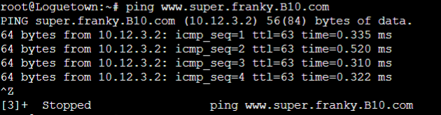
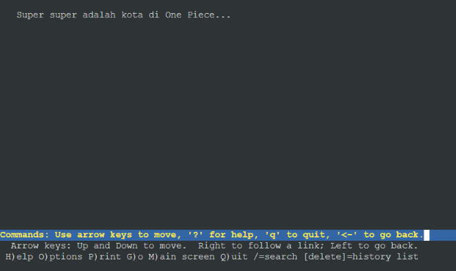
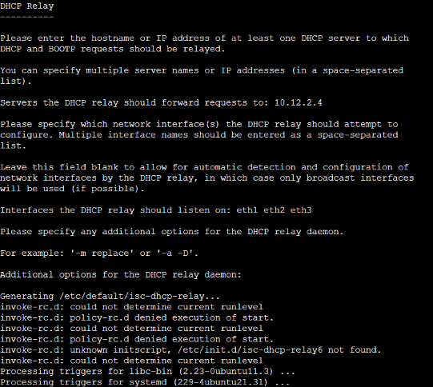
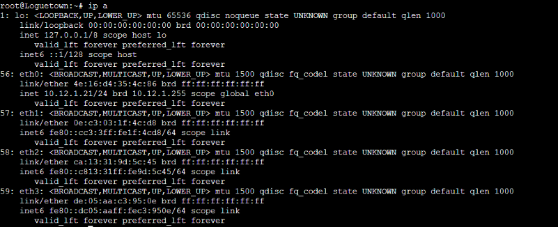

# Jarkom-Modul-3-B10-2021

## Anggota B10
Nama | NRP | Pembagian
------------ | ------------- | -------------
Pramudya Tiandana Wisnu Gautama | 05111940000018 | x - x
Jason Andrew Gunawan | 05111940000085 | x - x
Frans Wijaya | 05111940000098 | x - x

### Keterangan:
- yyy adalah nama kelompok Anda
- Untuk nomor 9, harus htpasswd yang melakukan enkripsi
- Bisa melakukan wget [GitHub](https://raw.githubusercontent.com/FeinardSlim/Praktikum-Modul-2-Jarkom/main/super.franky.zip) untuk mendapatkan file untuk super.franky.yyy.com

## Soal
Luffy yang sudah menjadi Raja Bajak Laut ingin mengembangkan daerah kekuasaannya dengan membuat peta seperti berikut:


## Soal 1
Luffy bersama Zoro berencana membuat peta tersebut dengan kriteria **EniesLobby** sebagai DNS Server, **Jipangu** sebagai DHCP Server, **Water7** sebagai Proxy Server (1),
### Solusi 1
Membuat topologi sebagai berikut:


#### Konfigurasi
**Foosha**
```
...
auto eth3
iface eth3 inet static
	address 10.12.3.1
	netmask 255.255.255.0
```
**Jipangu**
```
auto eth0
iface eth0 inet static
	address 10.12.2.4
	netmask 255.255.255.0
	gateway 10.12.2.1
```
**Skypie**
```
auto eth0
iface eth0 inet static
	address 10.12.3.2
	netmask 255.255.255.0
	gateway 10.12.3.1
```
**Tottoland**
```
auto eth0
iface eth0 inet static
	address 10.12.3.3
	netmask 255.255.255.0
	gateway 10.12.3.1
```
#### DNS Server
- Jalankan ```bash dns.sh``` pada EniesLobby dan Loguetown untuk menjalankan proses **restore** dari folder backup modul 2.
- Ganti IP dari Skypie pada file konfigurasi di EniesLobby ```nano /etc/bind/kaizoku/franky.B10.com``` menjadi `10.12.3.2`.
```
;
; BIND data file for local loopback interface
;
$TTL    604800
@       IN      SOA     franky.B10.com. root.franky.B10.com. (
                              2021102601                ; Serial
                         604800         ; Refresh
                          86400         ; Retry
                        2419200         ; Expire
                         604800 )       ; Negative Cache TTL
;
@       IN      NS      franky.B10.com.
@       IN      A       10.12.2.2
www     IN      CNAME   franky.B10.com.
super   IN      A       10.12.3.2
www.super       IN      CNAME   super.franky.B10.com.
```
- Jalankan ```bash web.sh``` pada Skypie untuk menjalankan proses restore dari backup modul 2 di bagian web server.
- Loguetown harusnya sekarang bisa ping dan membuka website www.super.franky.B10.com (testing page saat modul 2)





#### DHCP
- Install DHCP Server pada Jipangu.
```
apt-get update
apt-get install isc-dhcp-server -y
```
- Isi dengan "eth0" pada interfaces dalam file `/etc/default/isc-dhcp-server`.
```
...
# On what interfaces should the DHCP server (dhcpd) serve DHCP requests?
#       Separate multiple interfaces with spaces, e.g. "eth0 eth1".
INTERFACES="eth0"
```

#### Proxy Server
- Install dan start Squid pada Water7.
```
apt-get update
apt-get install squid
service squid start
```

## Soal 2
dan **Foosha** sebagai DHCP Relay (2). Luffy dan Zoro **menyusun peta tersebut dengan hati-hati dan teliti**.
### Solusi 2
**Foosha**
- Install DHCP Relay pada Foosha.
```
apt-get update
apt-get install isc-dhcp-relay
```

- Isi dengan IP Jipangu (`10.12.2.4`) pada bagian forward requests. Isi dengan `eth1 eth2 eth3` pada interfaces. Kosongi pada additional options.



- Isi file `/etc/default/isc-dhcp-relay`
```
...
# What servers should the DHCP relay forward requests to?
SERVERS="10.12.2.4"

# On what interfaces should the DHCP relay (dhrelay) serve DHCP requests?
INTERFACES="eth1 eth2 eth3"

# Additional options that are passed to the DHCP relay daemon?
OPTIONS=""
```
- Restart.
```
service isc-dhcp-relay restart
```
## Soal 3
Semua client yang ada **HARUS** menggunakan konfigurasi IP dari DHCP Server.

Client yang melalui Switch1 mendapatkan range IP dari [prefix IP].1.20 - [prefix IP].1.99 dan [prefix IP].1.150 - [prefix IP].1.169 (3)
### Solusi 3
#### Jipangu
- Edit file `/etc/dhcp/dhcpd.conf` untuk konfigurasi Switch 2 dan Switch 1.
```
...
subnet 10.12.2.0 netmask 255.255.255.0 {
    option routers 10.12.2.1;
}

subnet 10.12.1.0 netmask 255.255.255.0 {
    range 10.12.1.20 10.12.1.99;
    range 10.12.1.150 10.12.1.169;
    option routers 10.12.1.1;
    option broadcast-address 10.12.1.255;
    option domain-name-servers 10.12.2.2;
    default-lease-time 360;
    max-lease-time 7200;
}
```
- Start DHCP Server
```
service isc-dhcp-server start
```
#### Client
- Konfigurasi baru untuk Loguetown dan Alabasta di file `/etc/network/interfaces`. Comment line sebelumnya dan tambahkan line berikut.
```
auto eth0
iface eth0 inet dhcp
```
- Contoh file pada Loguetown:
```
#auto eth0
#iface eth0 inet static
#	address 10.12.1.2
#	netmask 255.255.255.0
#	gateway 10.12.1.1

auto eth0
iface eth0 inet dhcp
```
- Proses leasing DHCP berhasil:




## Soal 4
Client yang melalui Switch3 mendapatkan range IP dari [prefix IP].3.30 - [prefix IP].3.50 (4) 
### Solusi 4

## Soal 5
Client mendapatkan DNS dari EniesLobby dan client dapat terhubung dengan internet melalui DNS tersebut. (5)
### Solusi 5

## Soal 6
Lama waktu DHCP server meminjamkan alamat IP kepada Client yang melalui Switch1 selama 6 menit sedangkan pada client yang melalui Switch3 selama 12 menit. Dengan waktu maksimal yang dialokasikan untuk peminjaman alamat IP selama 120 menit. (6)
### Solusi 6

## Soal 7
Luffy dan Zoro berencana menjadikan **Skypie** sebagai server untuk jual beli kapal yang dimilikinya dengan **alamat IP yang tetap** dengan IP [prefix IP].3.69 (7). **Loguetown** digunakan sebagai client **Proxy** agar transaksi jual beli dapat terjamin keamanannya, juga untuk mencegah kebocoran data transaksi.
### Solusi 7

## Soal 8
Pada Loguetown, proxy **harus bisa diakses** dengan nama **jualbelikapal.yyy.com** dengan **port** yang digunakan adalah **5000** (8).
### Solusi 8

## Soal 9
Agar transaksi jual beli lebih aman dan pengguna website ada dua orang, proxy dipasang **autentikasi user proxy dengan enkripsi bcrypt** dengan **dua username**, yaitu luffybelikapalyyy dengan password luffy_yyy **dan** zorobelikapalyyy dengan password zoro_yyy (9).
### Solusi 9

## Soal 10
Transaksi jual beli tidak dilakukan setiap hari, oleh karena itu akses internet dibatasi hanya dapat diakses setiap hari **Senin-Kamis pukul 07.00-11.00** dan setiap hari **Selasa-Jum’at pukul 17.00-03.00** keesokan harinya **(sampai Sabtu pukul 03.00)** (10).
### Solusi 10

## Soal 11
Agar transaksi bisa lebih fokus berjalan, maka dilakukan redirect website agar mudah mengingat website transaksi jual beli kapal. Setiap **mengakses google.com, akan diredirect menuju super.franky.yyy.com** dengan website yang sama pada soal shift modul 2. Web server super.franky.yyy.com berada pada node **Skypie** (11).
### Solusi 11

## Soal 12
Saatnya berlayar! Luffy dan Zoro akhirnya memutuskan untuk berlayar untuk **mencari harta karun di super.franky.yyy.com**. Tugas pencarian dibagi menjadi dua misi, Luffy bertugas untuk mendapatkan gambar (.png, .jpg), sedangkan Zoro mencari sisanya. Karena Luffy orangnya sangat teliti untuk mencari harta karun, ketika ia berhasil mendapatkan gambar, ia mendapatkan gambar dan melihatnya dengan kecepatan **10 kbps** (12).
### Solusi 12

## Soal 13
Sedangkan, Zoro yang sangat bersemangat untuk mencari harta karun, sehingga kecepatan kapal Zoro tidak dibatasi ketika sudah mendapatkan harta yang diinginkannya (13).
### Solusi 13

## Kendala
- kosong